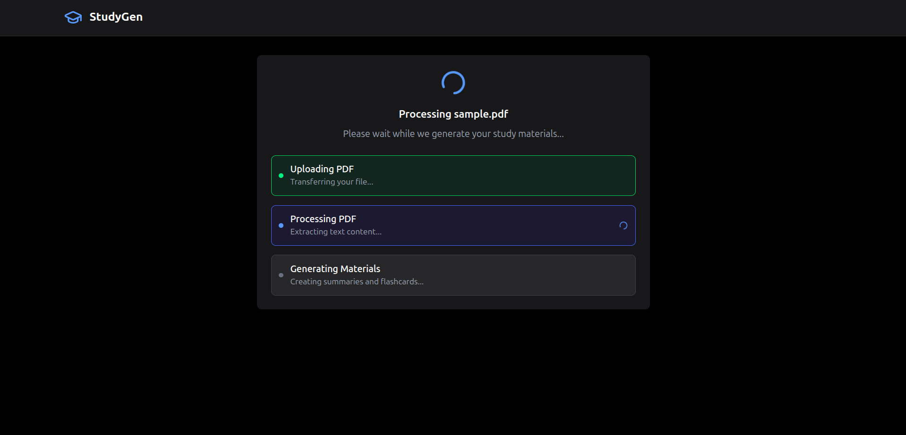
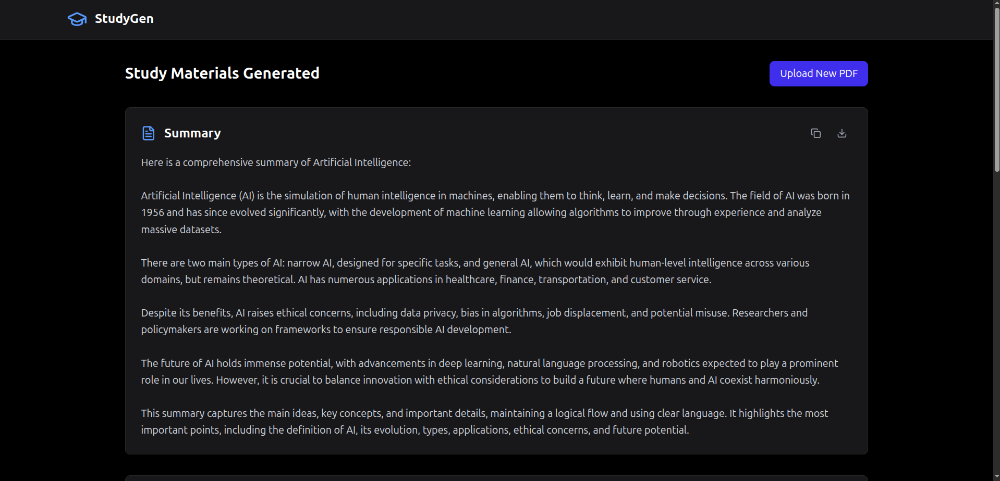
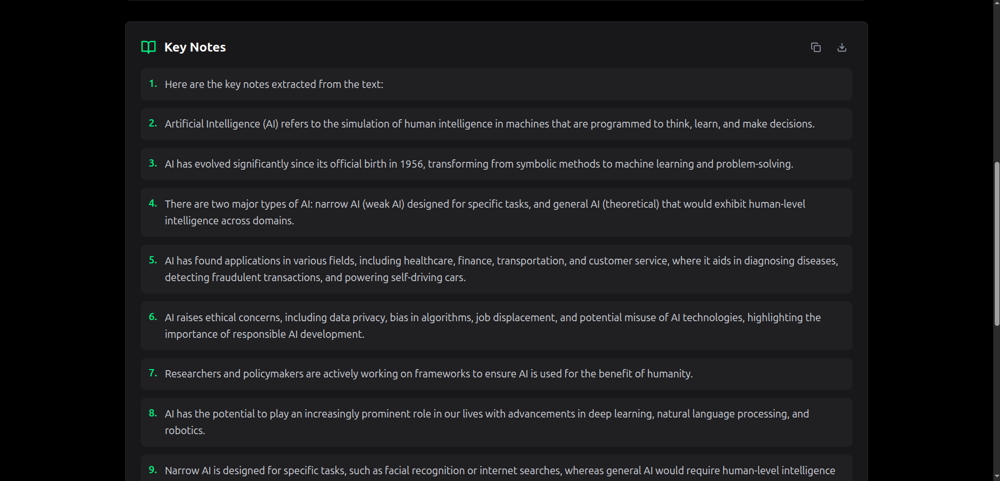
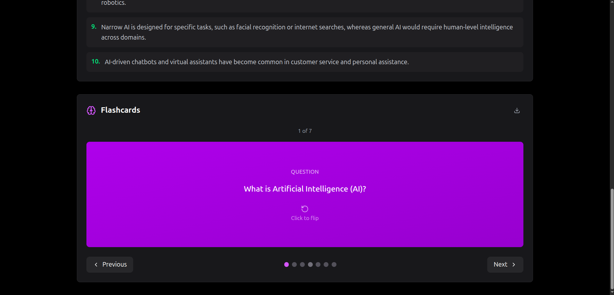

# Study Notes Generator

An AI-powered application that transforms PDF documents into comprehensive study materials including summaries, key notes, and interactive flashcards.

## Features

- **PDF Upload**: Drag-and-drop interface for easy PDF uploads
- **AI-Powered Processing**: Uses RAG (Retrieval Augmented Generation) with LangChain
- **Smart Summaries**: Comprehensive summaries highlighting key concepts
- **Key Notes**: Extracted important points in organized format
- **Interactive Flashcards**: Q&A flashcards with flip animation
- **Export Options**: Download summaries, notes, and flashcards
- **Dark Theme**: Modern, eye-friendly dark interface
- **Responsive Design**: Works perfectly on all devices

## Tech Stack

### Frontend
- **React 18** with TypeScript
- **Tailwind CSS** for styling
- **Lucide React** for icons
- **Vite** for development and building

### Backend
- **Python Flask** web framework
- **LangChain** for RAG implementation
- **FAISS** for vector storage
- **HuggingFace Embeddings** (free)
- **TogetherAI API** for cost-effective LLM access
- **PyPDF2** for PDF processing

## Quick Start

### Frontend Setup

1. Install dependencies:
```bash
npm install
```

2. Start the development server:
```bash
npm run dev
```

The frontend will be available at `http://localhost:5173`

### Backend Setup

1. Navigate to the backend directory:
```bash
cd backend
```

2. Install Python dependencies:
```bash
pip install -r requirements.txt
```

3. Set up environment variables:
```bash
cp .env.example .env
# Edit .env and add your TOGETHER_API_KEY
```

4. Start the Flask server:
```bash
python app.py
```

The backend will be available at `http://localhost:5000`

## Getting TogetherAI API Key

1. Visit [https://api.together.xyz/](https://api.together.xyz/)
2. Sign up for a free account
3. Get your API key from the dashboard
4. Add it to your `.env` file in the backend directory

## Usage

1. Open the application in your browser
2. Upload a PDF document using the drag-and-drop interface
3. Wait for AI processing to complete
4. Review the generated study materials:
   - **Summary**: Comprehensive overview of the document
   - **Notes**: Key points and important concepts
   - **Flashcards**: Interactive Q&A cards for active learning
5. Export materials for offline study

## AI Pipeline

The application uses a sophisticated RAG (Retrieval Augmented Generation) pipeline:

1. **PDF Processing**: Extract and clean text from uploaded PDFs
2. **Text Chunking**: Split documents into manageable segments
3. **Embeddings**: Convert text to vectors using HuggingFace models
4. **Vector Store**: Create searchable index with FAISS
5. **Retrieval**: Find relevant chunks for each query
6. **Generation**: Use TogetherAI's LLaMA model for content creation

## Cost Optimization

- Uses free HuggingFace embedding models
- Leverages TogetherAI's competitive LLM pricing
- Implements efficient text chunking
- Optimizes token usage for cost-effective processing

## Development

### Frontend Development
```bash
npm run dev      # Start development server
npm run build    # Build for production
npm run lint     # Run ESLint
```

### Backend Development
- Set `FLASK_DEBUG=True` in `.env` for development mode
- Use `python app.py` to start with hot reloading
- Check logs for debugging information

## Screenshots







## Contributing

1. Fork the repository
2. Create a feature branch
3. Make your changes
4. Test thoroughly
5. Submit a pull request


## Support

For issues and questions:
1. Check the existing issues
2. Create a new issue with detailed information
3. Include error logs and steps to reproduce

---

Built with ❤️ for students and educators worldwide.